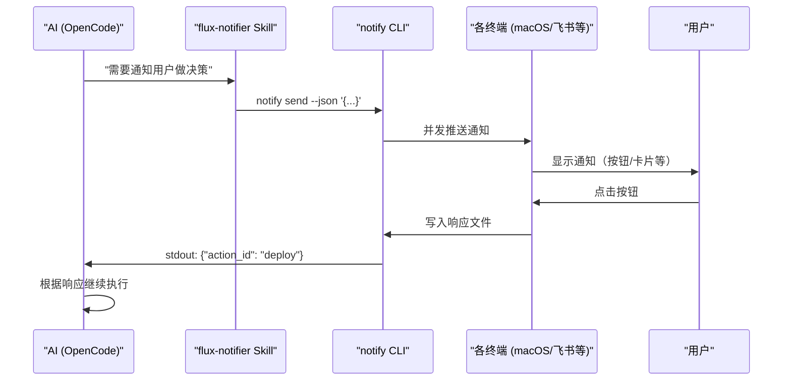

# OpenCode 集成指南

Flux Notifier 与 OpenCode 的集成通过 Skill 机制实现，AI 在需要通知用户时直接调用 `notify send` 命令。

---

## 安装 Skill

将 `packages/flux-notifier-skill/skill.md` 的内容复制到你的 OpenCode Skill 配置目录，或在 `AGENTS.md` 中引用。

---

## Skill 工作原理



---

## 使用场景

### 任务完成通知

```python
import subprocess, json

def notify_completion(title: str, body: str, jump_to_url: str = None):
    payload = {
        "version": "1",
        "event_type": "completion",
        "title": title,
        "body": body,
        "metadata": {"source_app": "opencode"}
    }
    if jump_to_url:
        payload["actions"] = [{
            "id": "view",
            "label": "查看结果",
            "style": "primary",
            "jump_to": {"type": "url", "target": jump_to_url}
        }]

    result = subprocess.run(
        ["notify", "send", "--json", json.dumps(payload)],
        capture_output=True, text=True, timeout=300
    )
    return json.loads(result.stdout)
```

### 需要用户选择

```python
def ask_user_choice(question: str, options: list[dict]) -> str:
    payload = {
        "version": "1",
        "event_type": "choice",
        "title": "需要你的决策",
        "body": question,
        "actions": options,
        "metadata": {"source_app": "opencode", "priority": "high"}
    }

    result = subprocess.run(
        ["notify", "send", "--json", json.dumps(payload), "--timeout", "300"],
        capture_output=True, text=True
    )
    response = json.loads(result.stdout)
    return response.get("action_id")

# 使用示例
action = ask_user_choice(
    "发现 3 个潜在安全问题，是否继续部署？",
    [
        {"id": "deploy", "label": "继续部署", "style": "primary"},
        {"id": "review", "label": "先审查", "style": "default"},
        {"id": "abort", "label": "中止", "style": "destructive"}
    ]
)

if action == "deploy":
    run_deployment()
elif action == "review":
    open_security_report()
else:
    abort_pipeline()
```

### 步骤摘要（不等待响应）

```python
def notify_step(step_name: str, summary: str, image_url: str = None):
    payload = {
        "version": "1",
        "event_type": "step",
        "title": f"✅ {step_name} 完成",
        "body": summary,
        "metadata": {"source_app": "opencode", "priority": "low"}
    }
    if image_url:
        payload["image"] = {"url": image_url}

    subprocess.run(
        ["notify", "send", "--json", json.dumps(payload), "--no-wait"],
        capture_output=True
    )
```

---

## Skill 定义文件

完整 Skill 定义见 [`packages/flux-notifier-skill/skill.md`](../packages/flux-notifier-skill/skill.md)。

Skill 核心逻辑：

1. 当 AI 需要通知用户时，判断事件类型（completion / choice / step / input_required）
2. 构造符合 Schema 的 JSON payload
3. 调用 `notify send --json '<payload>'`
4. 解析 stdout 返回值，根据用户响应继续执行

---

## 最佳实践

- **completion / step** 事件：使用 `--no-wait`，不打断 AI 工作流
- **choice / input_required** 事件：使用阻塞模式，等待用户响应后再继续
- **urgent** 事件：设置 `priority: urgent`，确保用户能及时看到
- **跳转链接** ：在 actions 中提供 `jump_to`，让用户能快速定位到相关上下文
- **超时处理** ：始终设置合理的 `--timeout`，避免 AI 永久阻塞
