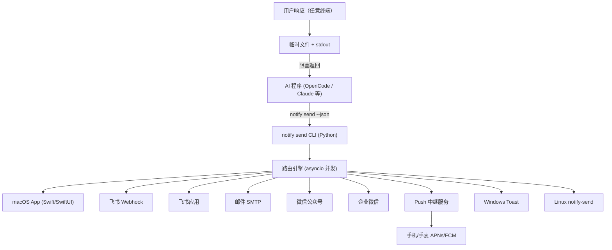

# Flux Notifier 项目总体规划

## 目标

Flux Notifier 是一个 AI 事件通知系统，让运行中的 AI 程序能通过统一接口，将需要用户关注的事件（任务完成、需要决策、步骤摘要、等待输入等）推送到用户配置的所有终端，并支持用户在任意终端响应交互。

### 核心设计目标

- **统一发送，差异渲染** ：一个标准 JSON 消息格式，各终端 Adapter 自行负责最优渲染
- **极小资源占用** ：各平台原生 App 尽可能小而精巧，空闲时接近零资源占用
- **阻塞式响应** ：`notify send` 命令阻塞等待用户响应，结果通过 stdout 返回，天然适配 AI 工作流
- **易于 AI 维护** ：模块化设计，清晰的扩展接口，Python 主控层 AI 可直接维护

---

## 系统架构



---

## 目录结构

```
flux-notifier/
│
├── packages/
│   │
│   ├── core/                            # Python 路由核心 + CLI
│   │   ├── flux_notifier/
│   │   │   ├── __init__.py
│   │   │   ├── cli.py                   # click CLI 入口
│   │   │   ├── schema.py                # Pydantic v2 消息 Schema
│   │   │   ├── router.py                # asyncio 并发路由
│   │   │   ├── response.py              # 用户响应回传机制
│   │   │   ├── config.py                # ~/.flux-notifier/config.toml 读写
│   │   │   └── adapters/
│   │   │       ├── base.py              # AdapterBase 抽象类
│   │   │       ├── macos.py             # Unix Socket → macOS App
│   │   │       ├── feishu_webhook.py    # 飞书自定义机器人 Webhook
│   │   │       ├── feishu_app.py        # 飞书开放平台应用消息
│   │   │       ├── email.py             # SMTP / aiosmtplib
│   │   │       ├── wechat_mp.py         # 微信公众号模板消息
│   │   │       ├── wechat_work.py       # 企业微信应用消息
│   │   │       ├── push.py              # → relay-server
│   │   │       ├── windows.py           # winrt Windows Toast
│   │   │       └── linux.py             # notify-send / D-Bus
│   │   ├── pyproject.toml
│   │   └── tests/
│   │
│   ├── macos-app/                       # Swift + SwiftUI macOS App
│   │   ├── FluxNotifier/
│   │   │   ├── FluxNotifierApp.swift    # @main, NSStatusItem MenuBar
│   │   │   ├── Models/
│   │   │   │   └── NotificationPayload.swift
│   │   │   ├── IPC/
│   │   │   │   └── UnixSocketServer.swift
│   │   │   ├── Notification/
│   │   │   │   ├── SystemNotificationManager.swift
│   │   │   │   └── NotificationWindowManager.swift
│   │   │   ├── Views/
│   │   │   │   ├── NotifyWindowView.swift
│   │   │   │   ├── ActionButtonsView.swift
│   │   │   │   ├── MarkdownBodyView.swift
│   │   │   │   └── NotifyImageView.swift
│   │   │   ├── Handlers/
│   │   │   │   ├── JumpHandler.swift
│   │   │   │   └── ResponseHandler.swift
│   │   │   └── Preferences/
│   │   │       └── PreferencesView.swift
│   │   └── FluxNotifier.xcodeproj
│   │
│   ├── relay-server/                    # FastAPI 手机 Push 中继
│   │   ├── app/
│   │   │   ├── main.py
│   │   │   ├── routes/
│   │   │   │   └── notify.py
│   │   │   ├── providers/
│   │   │   │   ├── apns.py
│   │   │   │   └── fcm.py
│   │   │   └── auth.py
│   │   ├── Dockerfile
│   │   ├── docker-compose.yml
│   │   └── pyproject.toml
│   │
│   └── opencode-skill/                  # OpenCode Skill 集成
│       ├── skill.md
│       ├── schema.json
│       └── examples/
│           ├── completion.json
│           ├── choice.json
│           └── step_summary.json
│
├── config/
│   └── config.example.toml
│
├── docs/
│   ├── project-plan.md          ← 本文件
│   ├── schema.md
│   ├── cli-reference.md
│   ├── opencode-integration.md
│   ├── development.md
│   └── adapters/
│       ├── macos.md
│       ├── feishu.md
│       ├── email.md
│       ├── wechat.md
│       └── push.md
│
├── scripts/
│   ├── install.sh
│   └── install.ps1
│
└── .github/
    └── workflows/
        ├── ci.yml
        └── release.yml
```

---

## 技术选型

### `packages/core` — Python 路由核心

| 组件 | 选型 | 理由 |
|------|------|------|
| CLI 框架 | `click` | 简洁，AI 可维护性强 |
| Schema 校验 | `pydantic v2` | 类型安全，JSON Schema 自动生成 |
| 并发路由 | `asyncio` + `anyio` | 多终端并发推送，不阻塞 |
| HTTP 客户端 | `httpx` | 异步，支持 HTTP/2（APNs 需要） |
| 配置文件 | `TOML` (`tomllib`) | Python 3.11+ 内置，零依赖 |
| 打包发布 | `pyproject.toml` + `pipx` | `pipx install flux-notifier` 一行安装 |
| 邮件发送 | `aiosmtplib` | 异步 SMTP |

### `packages/macos-app` — macOS 原生 App

| 能力 | 实现方式 |
|------|---------|
| 常驻后台 | `NSStatusItem` MenuBar App，无 Dock 图标 |
| 接收消息 | Unix Domain Socket，接收 Python core 推送 |
| 系统通知 | `UNUserNotificationCenter` |
| 自定义悬浮窗 | `NSPanel` + SwiftUI，`NSWindowLevel.floating` 始终置顶 |
| 按钮交互 | SwiftUI `Button`，支持 primary/destructive/default 样式 |
| 图片显示 | `AsyncImage`，支持 URL 和 Base64 |
| 跳转链接 | `NSWorkspace.shared.open(url)`，支持 `vscode://`、`pycharm://`、`http://` |
| 自启动 | `SMAppService.mainApp.register()` |
| 分发方式 | Homebrew Cask |

**资源占用目标** ：空闲时 < 5MB 内存，0% CPU。

### `packages/relay-server` — Push 中继服务

| 组件 | 选型 |
|------|------|
| Web 框架 | `FastAPI` |
| APNs | `httpx` + JWT 认证（HTTP/2） |
| FCM | Firebase Admin SDK |
| 部署 | Docker + docker-compose |
| 认证 | API Key（Bearer Token） |

支持官方托管实例和用户自托管两种模式。

---

## 各终端能力矩阵

| 能力 | macOS | 飞书 Webhook | 飞书应用 | 邮件 | 微信公众号 | 企业微信 | 手机 Push | Windows | Linux |
|------|-------|------------|--------|------|---------|--------|---------|---------|-------|
| 标题 + 正文 | ✅ | ✅ | ✅ | ✅ | ✅ | ✅ | ✅ | ✅ | ✅ |
| Markdown 渲染 | ✅ | ✅ | ✅ | ✅ (HTML) | ❌ | ❌ | ❌ | ❌ | ❌ |
| 图片 | ✅ | ✅ | ✅ | ✅ | ✅ | ✅ | ✅ | ✅ | ❌ |
| 按钮交互 | ✅ | ✅ | ✅ | ❌ | ❌ | 有限 | 有限 | 有限 | ❌ |
| 跳转链接 | ✅ | ✅ | ✅ | ✅ | ✅ | ✅ | ✅ | ✅ | ✅ |
| IDE 跳转 | ✅ | ❌ | ❌ | ❌ | ❌ | ❌ | ❌ | ✅ | ❌ |
| 用户响应回传 | ✅ | ✅ | ✅ | ❌ | ❌ | 有限 | ❌ | ✅ | ❌ |

---

## 用户响应回传机制

**设计选择：stdout 直接返回（阻塞式）**

```bash
# AI 程序调用示例（shell）
result=$(notify send --json '...')
action_id=$(echo $result | python -c "import sys,json; print(json.load(sys.stdin)['action_id'])")

# AI 程序调用示例（Python）
import subprocess, json
result = subprocess.run(["notify", "send", "--json", payload], capture_output=True, text=True)
response = json.loads(result.stdout)
action_id = response["action_id"]
```

**实现原理** ：
1. `notify send` 发送通知后，在 `~/.flux-notifier/responses/<notification-id>` 创建监听文件
2. 任意终端（macOS 悬浮窗、飞书按钮回调等）用户点击后，写入响应到该文件
3. `notify send` 检测到文件写入后读取内容，输出到 stdout 并退出
4. 支持超时配置（默认无超时），超时后输出 `{"action_id": null, "timeout": true}`

---

## 配置文件结构

配置文件位于 `~/.flux-notifier/config.toml`。完整示例见 [`config/config.example.toml`](../config/config.example.toml)。

**初始化命令** ：
```bash
flux-notifier setup        # 交互式配置向导
flux-notifier config list  # 查看当前配置
flux-notifier config test  # 测试各终端连通性
```

---

## 开发路线图

### Phase 1 — MVP（核心可用）

目标：从 CLI 发送通知，能在 macOS 和飞书上显示，支持用户响应回传。

- [ ] `packages/core` — CLI 骨架，Pydantic Schema，配置读取
- [ ] `packages/core/adapters/macos.py` — Unix Socket 发送
- [ ] `packages/macos-app` — MenuBar App，UnixSocket 接收，系统通知 + 自定义悬浮窗
- [ ] 响应回传机制（临时文件 + stdout）
- [ ] `packages/core/adapters/feishu_webhook.py` — 飞书消息卡片
- [ ] 基础测试覆盖

### Phase 2 — 多终端完善

- [ ] `feishu_app`、`email`、`wechat_work` Adapter
- [ ] `packages/relay-server` + `push` Adapter
- [ ] Windows Toast Adapter
- [ ] Linux notify-send Adapter
- [ ] `flux-notifier setup` 交互式配置向导

### Phase 3 — 生态与发布

- [ ] `packages/opencode-skill` 完整发布
- [ ] Homebrew Cask 发布流程（`.github/workflows/release.yml`）
- [ ] PyPI 发布（`pipx install flux-notifier`）
- [ ] 手表支持（watchOS companion 或通过手机 Push 透传）
- [ ] 官方文档站

---

## 贡献新 Adapter

每个 Adapter 继承 `AdapterBase`，实现以下方法：

```python
class MyAdapter(AdapterBase):
    name = "my_adapter"

    async def send(self, payload: NotificationPayload) -> SendResult:
        ...

    async def health_check(self) -> bool:
        ...
```

详见 [development.md](development.md)。
